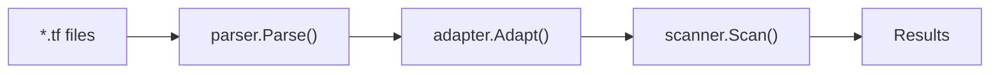

# Architecture

This document aims to answer the question _Where is the code that does X?_

For more information please check out our [contributing guide](CONTRIBUTING.md) or get in touch with us via Slack/issues/discussions.

## Important Packages

At a very high level, tfsec is structured like this. The most important packages are broken down below.

### Entrypoint: `cmd/tfsec`

The entry point for the main _tfsec_ CLI.

### CLI: `internal/app/tfsec/cmd`

Code to support running in the CLI, including flags, output settings etc.

### Parser

Can be found in [defsec/parsers](https://github.com/aquasecurity/defsec/parsers).

Takes plaintext Terraform HCL templates as input and produces logical abstractions from the `internal/pkg/block` package. Returns a slice of _modules_ which in turn contain blocks which can contain other blocks, which can in turn ultimately contain attributes, as is the HCL format. Each of the abstractions for these concepts has many utility methods.

### Adapters

Can be found in [defsec](https://github.com/aquasecurity/defsec/adapters/terraform).

Takes the abstracted Terraform building blocks mentioned above e.g. _blocks_, _resources_, _attributes_ etc. as input and _adapts_ them into a common data format which represents cloud resource e.g. a struct which represents an AWS S3 bucket.

### Scanner: `pkg/scanner`

Takes the _adapted_ cloud resources as input and runs all defsec rules against them. Returns a list of results as output.

### Testing: `test`

End-to-end tests that pull example Terraform code from defsec, run it through `tfsec` and apply all defsec rules, ensuring the expected result for each code example.
